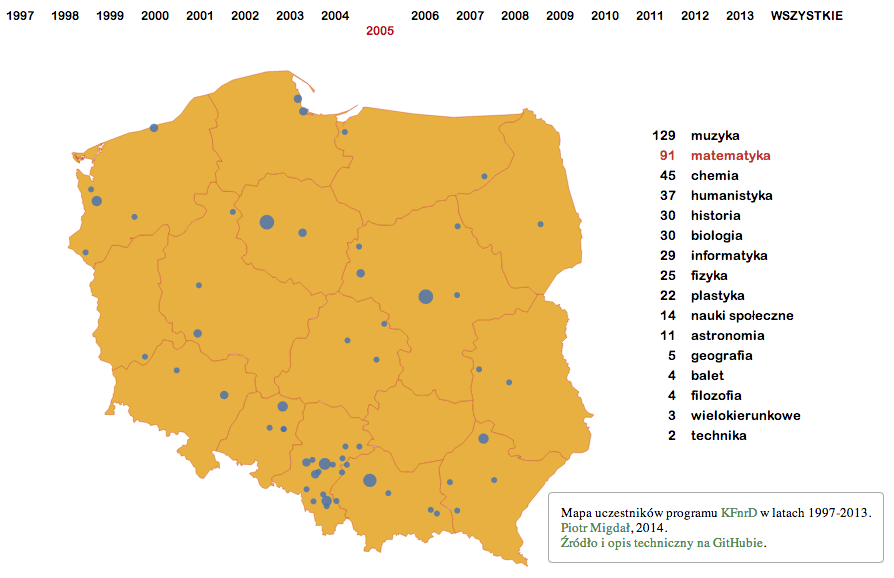

# Wizualizacje KFnrD

Wizualizacje z danych [Krajowego Funduszu na rzecz Dzieci](http://fundusz.org/) - organizacji pożytku publicznego pomagającej zdolnej młodzieży.

* [Mapa uczestników i ich zainteresowań w latach 1997-2013](http://stared.github.io/kfnrd_viz/mapa.html)
* Inne nadejdą

# Źródła

* Uczestnicy, dziedziny: Krajowy Fundusz na rzecz Dzieci.
* Wizualizacja w bibliotece [D3.js](http://d3js.org/) i [Topojson](http://bost.ocks.org/mike/map/).
* Geolokalizacje miast: [Google Geocoding API](https://developers.google.com/maps/documentation/geocoding/).
* Mapa Polski:
	* Dane z [Global Administrative Areas (GADM)](http://www.gadm.org/), plik shapefile `POL_adm0.shp` ([POL_adm.zip](http://biogeo.ucdavis.edu/data/gadm2/shp/POL_adm.zip)).
	* Następnie przetworzone na Topojson, zgodnie z intrukcją [Interactive Map with d3.js](http://www.tnoda.com/blog/2013-12-07):

    $ ogr2ogr -f GeoJSON -simplify 0.01 poland_border.json POL_adm0.shp
    $ topojson -o poland_border.topo.json poland_border.json

# Uwagi

Też chcesz umieć taką stworzyć? Daj nura w [mój wstęp](http://smarterpoland.pl/index.php/2014/06/metawstep-do-wizualizacji-danych-w-d3-js/).

Żadna metoda geolokalizacji nie jest w 100% skuteczna. Każde dane mogą zawierać śladowe ilości błędów, a także orzechów arachidowych. Gdzie się przetwarzający dane speiszy, tam się entropia cieszy.
